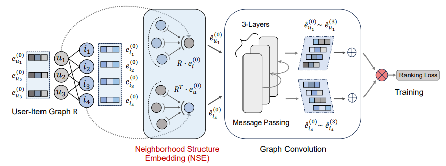

# Enhancing Graph Collaborative Filtering via Neighborhood Structure Embedding

*Xinzhou Jin, Jintang Li, Yuanzhen Xie, Liang Chen, Beibei Kong, Lei Cheng, Bo Hu, Zang Li, Zibin Zheng*

This is the official PyTorch implementation of our paper that has been accepted to 2023 IEEE International Conference on Data Mining (ICDM 2023). [[Paper]](https://ieeexplore.ieee.org/document/10415768)




## Requirements:

```
python>=3.9.13
pytorch>=1.12.1
torch-geometric>=2.2.0
torch-sparse>=0.6.15+pt112cu116
numpy>=1.24.3
pandas>=1.5.0
CUDA 11.6
```


## Installation

```bash
# create new conda environment
conda create -n NSE python=3.9
conda activate NSE
# install some packages
pip install -r requirements.txt
# PyTorch and PyG depend on your own cuda environment. The following instructions are for CUDA11.6.
pip install torch==1.12.1+cu116 -f https://download.pytorch.org/whl/torch/
pip install torch-sparse==0.6.16 -f https://pytorch-geometric.com/whl/torch-1.12.1+cu116.html
pip install torch-scatter==2.1.0 -f https://pytorch-geometric.com/whl/torch-1.12.1+cu116.html
pip install torch-geometric
```


## Datasets

| Datasets | #Users  | #Items | #Interactions | Density |
| -------- | ------- | ------ | ------------- | ------- |
| ML-1M    | 6,039   | 3,628  | 836,478       | 0.03818 |
| Yelp     | 45,477  | 30,708 | 1,777,765     | 0.00127 |
| Books    | 58,144  | 58,051 | 2,517,437     | 0.00075 |
| Gowalla  | 29,858  | 40,988 | 1,027,464     | 0.00084 |
| Alibaba  | 300,000 | 81,614 | 1,607,813     | 0.00007 |

For `ml-1m` , `yelp`, `amazon-books`, `gowalla-merged`, they will be automatically downloaded via RecBole once you run the main program.

For `alibaba`, we provide it under `dataset/`

```
cd dataset
unzip alibaba.zip
```


## Implementation of NSE:

NSE is easy to implement as follows (PyTorch-style):

```python
def get_neighbor_adj(self):
    from torch_sparse import SparseTensor
    sp_adj = SparseTensor(row=self._user, col=self._item, value=torch.ones(
        len(self._user)), sparse_sizes=(self.n_users, self.n_items))
    return sp_adj


def get_ego_embeddings(self):
        r""" Get the embedding of users and items and combine to an embedding matrix.
        Returns:
            Tensor of the embedding matrix. Shape of [n_items+n_users, embedding_dim]
        """
        from torch_geometric.utils import spmm
        user_embeddings = spmm(self.sp_adj, self.item_embedding.weight).to_dense()
        item_embeddings = spmm(self.sp_adj.t(), self.user_embedding.weight).to_dense()
        ego_embeddings = torch.cat([user_embeddings, item_embeddings], dim=0)

        return ego_embeddings
```


## Reproduction

We integrate our NSE-LGCN method into the [RecBole](https://recbole.io/) and [RecoBole-GNN](https://github.com/RUCAIBox/RecBole-GNN) framework.

#### ML-1M


```
python run_recbole_gnn.py --dataset "ml-1m" --model "NSELightGCN" --n_layers 3 --reg_weight 0.0001 --learning_rate 0.0002
```

#### Yelp


```
python run_recbole_gnn.py --dataset "yelp" --model "NSELightGCN" --n_layers 3 --reg_weight 0.01 --learning_rate 0.0001
```

#### Amazon-books


```
python run_recbole_gnn.py --dataset "amazon-books" --model "NSELightGCN" --n_layers 3 --reg_weight 0.001 --learning_rate 0.0001
```

#### Gowalla


```
python run_recbole_gnn.py --dataset "gowalla-merged" --model "NSELightGCN" --n_layers 3 --reg_weight 0.0001 --learning_rate 0.0001
```

#### Alibaba


```
python run_recbole_gnn.py --dataset "alibaba" --model "NSELightGCN" --n_layers 3 --reg_weight 1e-06 --learning_rate 0.0001
```


If you want to run on the synthetic datasets, add `--ptb_strategy=replace` to the above commands. For example:

```
python run_recbole_gnn.py --dataset "ml-1m" --model "NSELightGCN" --n_layers 3 --reg_weight 0.01 --learning_rate 0.0001 --ptb_strategy=replace
```


## Acknowledgement

This repo is mainly based on [RecBole](https://recbole.io/) and [RecoBole-GNN](https://github.com/RUCAIBox/RecBole-GNN). Many thanks to their wonderful work!


## Citation

If you find this work is helpful to your research, please consider citing our paper:

```
@inproceedings{jin2023enhancing,
  title={Enhancing Graph Collaborative Filtering via Neighborhood Structure Embedding},
  author={Xinzhou Jin and Jintang Li and Yuanzhen Xie and Liang Chen and Beibei Kong and Lei Cheng and Bo Hu and Zang Li and Zibin Zheng},
  booktitle={ICDM},
  year={2023}
}
```


## Contact

If you have any questions about this work, please feel free to contact me via downeykking@gmail.com
